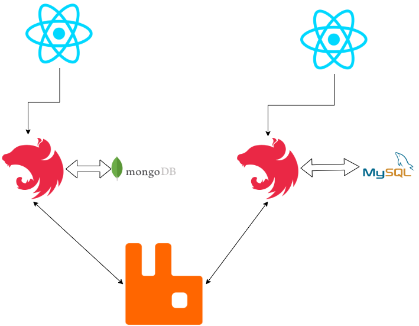

### Microservice Nest.js with RabbitMQ

## how to run

1- setup DBs and rabbitmq using docker-compose

```bash
docker-compose up
```

2- install depecencies

```bash
cd admin_backend && yarn
```

```bash
cd main_backend && yarn
```

```bash
cd admin_frontend && yarn
```

3- run the microservices

```bash
cd admin_backend && yarn start:dev
```

```bash
cd main_backend && yarn start:dev
```

```bash
cd admin_frontend && yarn start
```

5- open `http://localhost:3000` in browser
